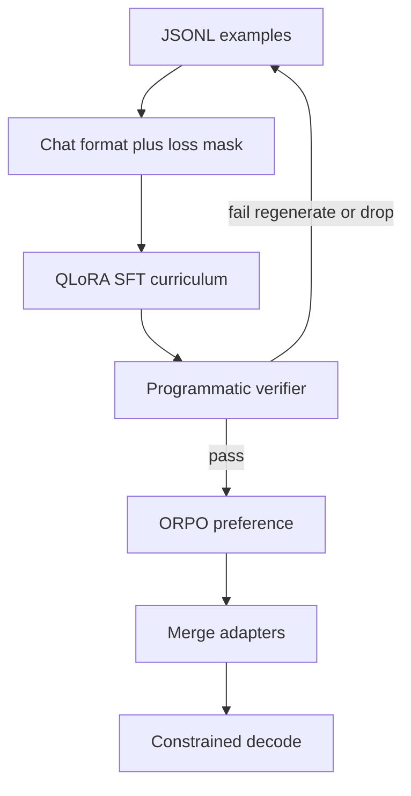

# Training Mechanics Tutorial

How to train the Security Event Intelligence (SEI) SLM: format data, run curriculum QLoRA SFT, verify examples, align with ORPO, serve with constrained decoding, and export GGUF.

**Stack:** `transformers` + `peft` + `trl` + `bitsandbytes` (train); `vllm` or `llama.cpp` (serve).



## Dependencies

```text
torch>=2.2
transformers>=4.45
peft>=0.13
trl>=0.12
bitsandbytes>=0.44
datasets>=3.0
accelerate>=0.34
vllm>=0.6          # GPU serve (optional)
sentencepiece
protobuf
pyyaml
jsonschema
scikit-learn
numpy
pandas
httpx
fastapi            # SIEM webhook demo
uvicorn
```

Install: `pip install -e ".[train,serve,demo]"` from the repo root.

---

## 1. Mental model: IE, not chat

We teach one mapping:

`system + telemetry (+ optional RAG cards) → one JSON object`

Loss is applied **only on assistant tokens** (the JSON). Prompt tokens are masked with `-100` so the model does not burn capacity memorizing log text.

---

## 2. One training row

Each composed example becomes a chat turn. Curriculum stages omit later fields until unlocked.

```python
import json

example = {
    "id": "atomic-t1059-001-042",
    "messages": [
        {
            "role": "system",
            "content": (
                "You are a SOC triage model. Emit ONLY valid SEI JSON. "
                "Technique IDs must be from ATT&CK v16.1. "
                "Evidence values must be exact substrings of the telemetry. "
                "Use needs_more_data / empty lists when unsupported."
            ),
        },
        {
            "role": "user",
            "content": (
                "TELEMETRY:\n"
                '{"timestamp":"2024-06-01T12:00:00Z","source":"sysmon",'
                '"raw":{"EventID":1,"Image":"C:\\\\Windows\\\\System32\\\\cmd.exe",'
                '"ParentImage":"C:\\\\Users\\\\jdoe\\\\payload.exe",'
                '"CommandLine":"cmd.exe /c whoami"}}\n'
                "CONTEXT:\n"
                '{"asset_criticality":"high","environment":"prod"}'
            ),
        },
        {
            "role": "assistant",
            "content": json.dumps({
                "incident": {
                    "disposition": "true_positive",
                    "category": "execution",
                    "summary": "Suspicious cmd spawned by user payload.",
                },
                "techniques": [{
                    "id": "T1059.003",
                    "name": "Windows Command Shell",
                    "tactic": "Execution",
                    "confidence": 0.86,
                }],
                "severity": {
                    "level": "high",
                    "score": 75,
                    "rationale": "Execution on high-criticality prod host.",
                },
                "confidence": 0.82,
                "evidence": [{
                    "telemetry_index": 0,
                    "field": "raw.CommandLine",
                    "value": "cmd.exe /c whoami",
                    "why": "Interactive recon via cmd under non-system parent.",
                }],
                "recommended_actions": [{
                    "priority": 1,
                    "type": "contain",
                    "action": "Isolate host and preserve process tree",
                    "d3fend_id": "D3-NI",
                }],
            }, separators=(",", ":")),
        },
    ],
    "meta": {
        "attack_version": "16.1",
        "source": "atomic+sigma",
        "license": "MIT",
        "synthetic": True,
        "curriculum_stage": 4,
        "split_group": "atomic-t1059-001",
    },
}
```

**Why compact JSON (`separators=(",", ":")`):** shorter targets → fewer tokens → stabler SFT on 8B. Pretty-print only for humans.

---

## 3. Chat template + label masking

Foundation-Sec is a base CPT checkpoint. Install the Llama-3 chat template (pinned in `src/sei/train/chat_template.py`) before Instruct SFT. Apply the template, then mask everything before the assistant span.

```python
from transformers import AutoTokenizer
from sei.train.chat_template import LLAMA3_CHAT_TEMPLATE

tokenizer = AutoTokenizer.from_pretrained(
    "fdtn-ai/Foundation-Sec-8B",
    use_fast=True,
)
if not tokenizer.chat_template:
    tokenizer.chat_template = LLAMA3_CHAT_TEMPLATE

def tokenize_sft_example(messages: list[dict], max_len: int = 4096) -> dict:
    text = tokenizer.apply_chat_template(
        messages,
        tokenize=False,
        add_generation_prompt=False,
    )
    tok = tokenizer(
        text,
        truncation=True,
        max_length=max_len,
        padding=False,
        return_tensors=None,
    )
    input_ids = tok["input_ids"]
    labels = list(input_ids)

    prompt_text = tokenizer.apply_chat_template(
        messages[:-1],
        tokenize=False,
        add_generation_prompt=True,
    )
    prompt_len = len(tokenizer(prompt_text, add_special_tokens=False)["input_ids"])
    labels[:prompt_len] = [-100] * prompt_len

    return {
        "input_ids": input_ids,
        "attention_mask": tok["attention_mask"],
        "labels": labels,
    }
```

Without masking, gradients reconstruct Sysmon JSON the model already sees at inference. With masking, capacity goes to disposition / T-IDs / evidence / actions.

---

## 4. QLoRA: load 8B on one GPU

4-bit base + LoRA adapters keeps iteration on a single 24GB-class GPU.

```python
import torch
from transformers import AutoModelForCausalLM, BitsAndBytesConfig
from peft import LoraConfig, get_peft_model, prepare_model_for_kbit_training

bnb = BitsAndBytesConfig(
    load_in_4bit=True,
    bnb_4bit_quant_type="nf4",
    bnb_4bit_compute_dtype=torch.bfloat16,
    bnb_4bit_use_double_quant=True,
)

model = AutoModelForCausalLM.from_pretrained(
    "fdtn-ai/Foundation-Sec-8B",
    quantization_config=bnb,
    device_map="auto",
    torch_dtype=torch.bfloat16,
)
model = prepare_model_for_kbit_training(model)

lora = LoraConfig(
    r=32,
    lora_alpha=64,
    lora_dropout=0.05,
    bias="none",
    task_type="CAUSAL_LM",
    target_modules=[
        "q_proj", "k_proj", "v_proj", "o_proj",
        "gate_proj", "up_proj", "down_proj",
    ],
)
model = get_peft_model(model, lora)
model.print_trainable_parameters()  # expect ~1–2% trainable
```

**Defaults:** `r=32`, `alpha=64`, dropout `0.05`, BF16 compute, packing off until sequences are short and stable. Configs live in `configs/`.

---

## 5. SFT loop with TRL

```python
from datasets import load_dataset
from trl import SFTTrainer, SFTConfig

ds = load_dataset("json", data_files={
    "train": "data/processed/stage4/train.jsonl",
    "eval": "data/processed/stage4/val.jsonl",
})

def formatting_func(row):
    return tokenizer.apply_chat_template(
        row["messages"], tokenize=False, add_generation_prompt=False
    )

args = SFTConfig(
    output_dir="checkpoints/sei-sft-stage4",
    num_train_epochs=2,
    per_device_train_batch_size=1,
    gradient_accumulation_steps=16,
    learning_rate=1e-4,
    lr_scheduler_type="cosine",
    warmup_ratio=0.03,
    logging_steps=20,
    eval_strategy="steps",
    eval_steps=200,
    save_steps=200,
    bf16=True,
    max_length=4096,
    packing=False,
    gradient_checkpointing=True,
    report_to="none",
)

trainer = SFTTrainer(
    model=model,
    args=args,
    train_dataset=ds["train"],
    eval_dataset=ds["eval"],
    processing_class=tokenizer,
    formatting_func=formatting_func,
)
trainer.train()
trainer.save_model("checkpoints/sei-sft-stage4/adapter")
```

Or run: `python scripts/train_sft.py --stage 4 --config configs/sft_stage4.yaml`

**Curriculum:** warm-start adapters from the previous stage. Filter with `meta.curriculum_stage <= N`.

| Stage | Assistant fields present |
|-------|--------------------------|
| 1 | `incident.disposition`, `severity` |
| 2 | + `techniques[]` |
| 3 | + `evidence[]` |
| 4 | full schema + abstain paths |
| 5 | ORPO pairs (chosen/rejected), not plain SFT |

---

## 6. Programmatic verifier

Before a row enters SFT/ORPO, validate. Bad synthetic rows poison technique enums.

```python
from sei.verify.validator import verify_example

errors = verify_example(telemetry_text, assistant_json)
assert not errors, errors
```

Pipeline: compose → verify → keep only rows with `errors == []`.

---

## 7. ORPO (stage 5)

Build pairs where **chosen** is verified gold and **rejected** is a deterministic failure mode (over-severity, invented T-ID, ungrounded evidence, laundry-list actions).

```python
from trl import ORPOTrainer, ORPOConfig

orpo_args = ORPOConfig(
    output_dir="checkpoints/sei-orpo",
    per_device_train_batch_size=1,
    gradient_accumulation_steps=16,
    learning_rate=5e-6,
    num_train_epochs=1,
    beta=0.1,
    bf16=True,
    max_length=4096,
    max_completion_length=1024,
)
```

Run: `python scripts/train_orpo.py --config configs/orpo.yaml`

Rejected pair recipes (see `src/sei/train/preferences.py`):
- Same techniques, severity bumped two levels with no new evidence
- Valid JSON but `techniques[].id` not in ATT&CK set
- Evidence quote not in telemetry
- 8+ vague actions

---

## 8. Constrained decoding at inference

Training teaches content; **grammar enforces shape**. Never ship unconstrained sampling for technique IDs in production.

```python
from vllm import LLM, SamplingParams
from vllm.sampling_params import GuidedDecodingParams
from pathlib import Path
import json

guided = GuidedDecodingParams(json=Path("schemas/sei_v1.json").read_text())
params = SamplingParams(temperature=0.0, max_tokens=1024, guided_decoding=guided)
llm = LLM(model="checkpoints/sei-orpo-merged", max_model_len=4096)
outputs = llm.generate([prompt], params)
sei = json.loads(outputs[0].outputs[0].text)
# Still run verify_example() — grammar ≠ grounded evidence
```

Air-gap: `llama-cli -m sei-8b-instruct-q4_k_m.gguf --grammar-file grammars/sei_v1.gbnf`

**RAG:** retrieve top-k ATT&CK cards (`src/sei/rag/`) and inject into the user message before generate.

---

## 9. Merge adapters and export GGUF

```python
from peft import PeftModel
from transformers import AutoModelForCausalLM
import torch

base = AutoModelForCausalLM.from_pretrained(
    "fdtn-ai/Foundation-Sec-8B", torch_dtype=torch.bfloat16, device_map="cpu"
)
merged = PeftModel.from_pretrained(base, "checkpoints/sei-orpo/adapter")
merged = merged.merge_and_unload()
merged.save_pretrained("checkpoints/sei-8b-instruct")
```

```bash
python scripts/export_gguf.py --model checkpoints/sei-8b-instruct --quant Q4_K_M
```

Ship: merged weights (or GGUF) + `schemas/sei_v1.json` + `grammars/sei_v1.gbnf` + pinned ATT&CK ID list + `NOTICE`.

---

## 10. Smoke test (CI)

```bash
python scripts/smoke_test.py --golden data/golden/
```

Asserts schema-valid (or verifier-clean) outputs on the golden set after each curriculum stage.

---

## 11. Hyperparameter cheat sheet

| Knob | v1 default | Notes |
|------|------------|-------|
| Sequence length | 4096 | Truncate oldest telemetry events first |
| Effective batch | 16–32 | Grad accum on 1×24GB |
| SFT LR | 1e-4 | Cosine, 3% warmup |
| ORPO LR | 5e-6 | 1 epoch |
| LoRA r / alpha | 32 / 64 | |
| Epochs / stage | 1–2 | Early-stop on val disposition F1 |
| Temperature (serve) | 0.0–0.2 | Never high-temp for triage JSON |

---

## 12. Troubleshooting

| Symptom | Fix |
|---------|-----|
| OOM | Lower `max_length`, raise `gradient_accumulation_steps`, or reduce LoRA `r` |
| Invalid JSON during train | Tighten composer; run verifier before writing JSONL |
| Technique collapse to few IDs | Check class balance; increase stage-2 data; raise LoRA `r` to 64 |
| Ungrounded evidence | Verifier should drop those rows; harden composer quotes |
| Schema-valid but wrong disposition | More GUIDE-anchored stage-1 data; check OrgId holdout |
